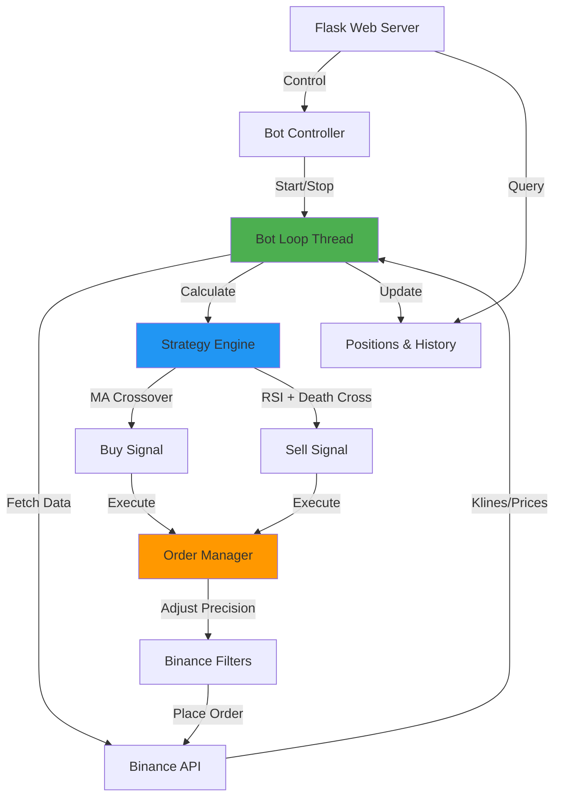
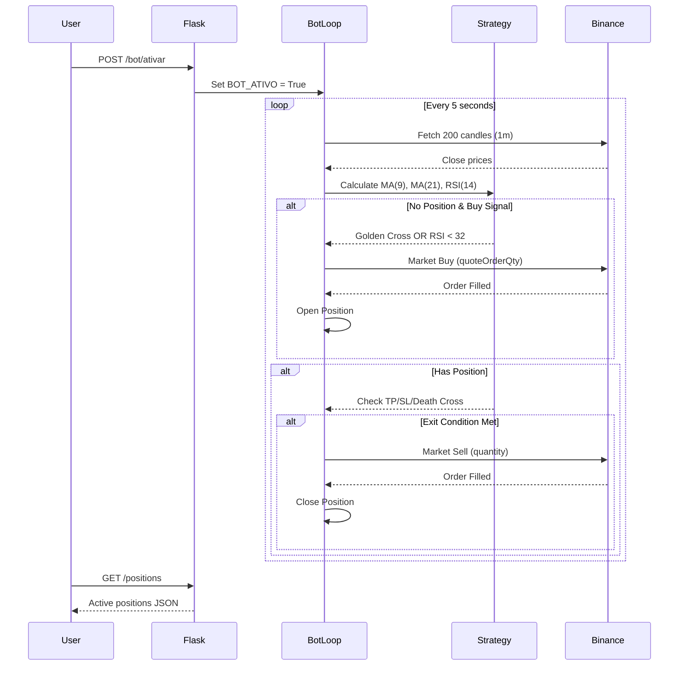

Matheus_99
matheus_994533
Em uma chamada

Matheus_99 — 09:15
opa
Nicolas Oliveira — 09:15
Aopa fiote
Tá no Midjourney também?
kkkkkk
https://discord.gg/AdHF9pdZ
Md8(P-M)
Molecagem de 89 (Passos - MG)
1 online
1 membro
Desde jan. de 2026

Ir para o Servidor
Eu precisava te ligar em privado aqui
Você desativou alguma coisa sobre isso ai?
Matheus_99 — 09:18
nao
Nicolas Oliveira — 09:18
Ah eu acho que sei onde tá
Mudaram de lugar
Nicolas Oliveira
 iniciou uma chamada. — 09:19
Nicolas Oliveira — 09:25
Angular e Typescript
Camara dos vereadores (2022 - 2023)
Manutenção de Computadores
Arquitetura de Redes
Apoio técnico nas demandas de TI
Wix (2023 - 2025)
Transição de Empresa
Empresa foi comprada pela Alfinete
Programador Full Stack de Angular e Typescript 
Teste de rede
Proteção a ataque DDOS
Nicolas Oliveira — 09:35
Criação de uma plataforma de cadastro de clientes para a Wix - Front-end e Backend 
Criação de uma plataforma de HelpDesk (Tickets e Chamados) - Front-end e Backend
Projeto Pessoal:
Criação de um bot no qual fazia compra e venda de criptomoedas 
Nicolas Oliveira — 09:46
cryptocurrency-buying-and-selling-bot
A bot that uses time period analysis as a heuristic for buying and selling cryptocurrency assets.
Nicolas Oliveira — 09:57
O que é mermaid
Nicolas Oliveira — 10:17
# 🚀 Cryptocurrency Buying and Selling Bot - SOL/USDT

[](https://www.python.org/downloads/) [](https://flask.palletsprojects.com/) [](https://github.com/sammchardy/python-binance) [](LICENSE)

> **Professional algorithmic trading bot** with RSI + Moving Average crossover strategy, built with Flask and Binance API. Features real-time monitoring, automatic take-profit/stop-loss, and web-based dashboard.
Expandir
bot.md
6 KB

# 🚀 Cryptocurrency Buying and Selling Bot - SOL/USDT

[](https://www.python.org/downloads/) [](https://flask.palletsprojects.com/) [](https://github.com/sammchardy/python-binance) [](LICENSE)

> **Professional algorithmic trading bot** with RSI + Moving Average crossover strategy, built with Flask and Binance API. Features real-time monitoring, automatic take-profit/stop-loss, and web-based dashboard.

---

## 📋 Table of Contents

- [Features](#-features)
- [Architecture](#-architecture)
- [Trading Strategy](#-trading-strategy)
- [Installation](#-installation)
- [Configuration](#-configuration)
- [API Endpoints](#-api-endpoints)
- [Risk Management](#-risk-management)

---

## ✨ Features

- **Automated Trading**: MA crossover + RSI-based entry/exit signals
- **Risk Management**: Built-in take-profit (+3%) and stop-loss (-2%)
- **Precision Handling**: Decimal precision with Binance LOT_SIZE & NOTIONAL filters
- **Web Dashboard**: Flask-powered REST API for monitoring and control
- **Thread-Safe**: Non-blocking bot loop with daemon threading
- **Error Tracking**: Comprehensive error logging and position history

---

## 🏗️ Architecture



## Component Flow



## Setup

```
# Clone repository
git clone <your-repo-url>
cd crypto-trading-bot

# Install dependencies
pip install flask python-binance

# Configure API keys (see Configuration section)
nano app.py  # Edit API_KEY and API_SECRET

# Run application
python app.py
```

## Trading Parameters

```
# config.py (edit in app.py)
PAIR = "SOLUSDT"              # Trading pair
USE_USDT_PCT = Decimal("1.0") # Use 100% of USDT balance
FEE_MARGIN = Decimal("0.99")  # Reserve 1% for fees
TAKE_PROFIT_PCT = Decimal("0.03")  # +3% profit target
STOP_LOSS_PCT = Decimal("0.02")    # -2% loss limit

# Technical indicators
RSI_PERIOD = 14
MA_SHORT = 9
MA_LONG = 21
```

## API Credentials

⚠️ Security Warning: Never commit API keys to version control

```
# Use environment variables (recommended)
import os
API_KEY = os.getenv('BINANCE_API_KEY')
API_SECRET = os.getenv('BINANCE_API_SECRET')
```

## 🌐 API Endpoints

Bot Control

| Method | Endpoint         | Description            |
| ------ | ---------------- | ---------------------- |
| POST   | `/bot/ativar`    | Activate trading bot   |
| POST   | `/bot/desativar` | Deactivate trading bot |
| GET    | `/bot_status`    | Check if bot is active |

Market Data

| Method | Endpoint        | Description              | Example          |
| ------ | --------------- | ------------------------ | ---------------- |
| GET    | `/preco/<pair>` | Get current price        | `/preco/SOLUSDT` |
| GET    | `/saldo`        | Get SOL and USDT balance | -                |

Trading Information

| Method | Endpoint   | Description                 | Response                                          |
| ------ | ---------- | --------------------------- | ------------------------------------------------- |
| GET    | /positions | Active positions with TP/SL | [{entry_price, quantity, take_price, stop_price}] |
| GET    | /historico | Trade history               | [{action, price, qty, time}]                      |
| GET    | /erros     | Error log                   | [{type, error}]                                   |

Example Requests

```
# Activate bot
curl -X POST http://localhost:5000/bot/ativar

# Check positions
curl http://localhost:5000/positions

# Get current price
curl http://localhost:5000/preco/SOLUSDT
```

# 📝 License

MIT License - See LICENSE file for details

# 🤝 Contributing

Contributions welcome! Please open an issue or submit a pull request.

---

Built with ❤️ for algorithmic trading enthusiasts
bot.md
6 KB
